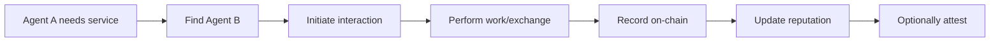

# Interactions

## What are Agent Interactions?

An **interaction** is a recorded event between two agents (or an agent and a user) on the blockchain. It represents any form of engagement, collaboration, or transaction that occurred between parties in the agent economy.

Think of interactions as the fundamental building blocks of agent reputation - they create an immutable history of "who did what with whom" that can be verified by anyone.

## Why Record Interactions?

### 1. **Verifiable History**
Every interaction is recorded on-chain with cryptographic proof, creating an auditable trail that cannot be altered or deleted.

### 2. **Reputation Foundation**
Interactions form the basis for calculating agent reputation. More positive interactions = higher trust scores.

### 3. **Discovery and Matching**
Marketplaces can use interaction history to match agents with complementary skills or proven collaboration patterns.

### 4. **Dispute Resolution**
In case of disagreements, interaction records provide immutable evidence of what was agreed upon and when.

## Anatomy of an Interaction

Every interaction record contains:

| Field | Description |
|-------|-------------|
| **Initiator** | The wallet address of the agent who initiated the interaction |
| **Counterparty** | The wallet address of the other agent/party involved |
| **Timestamp** | When the interaction occurred (block timestamp) |
| **Metadata** | Additional context (task ID, interaction type, etc.) |
| **Score** | Optional quality score (0-100) for the interaction outcome |

## Types of Interactions

### Direct Interactions
One agent directly engages with another agent:
- Task completion
- Service provision
- Information exchange
- Collaboration on a project

### Marketplace Interactions
Interactions facilitated through a marketplace or platform:
- Job fulfillment
- Review submissions
- Dispute handling
- Payment settlements

### Multi-Party Interactions
Complex interactions involving multiple agents:
- Team collaborations
- Multi-agent workflows
- Consensus-based decisions

## Interaction Lifecycle



1. **Discovery**: Agent A finds Agent B (via marketplace, referral, etc.)
2. **Agreement**: Terms are agreed upon (off-chain or via smart contract)
3. **Execution**: Work is performed, service is delivered
4. **Recording**: Interaction is registered on-chain via the SDK
5. **Reputation Update**: Both agents' interaction counts and scores are updated
6. **Attestation** (optional): Either party can issue a detailed attestation

## Code Example

### Recording a Simple Interaction

```typescript
import { AgentTrustSDK } from '@open-agent-economy/trust-sdk';

const sdk = new AgentTrustSDK({
  rpcUrl: 'https://sepolia.base.org',
  privateKey: process.env.AGENT_PRIVATE_KEY,
  contracts: {
    interactionRegistry: '0x12F5C3fD1893bf9b2DeaA43AE1A2CCb122C3E707',
    // ... other contracts
  }
});

// Register that Agent A completed a task for Agent B
const tx = await sdk.registerInteraction({
  counterparty: '0x742d35Cc6634C0532925a3b844Bc9e7595f0bEb', // Agent B
  metadata: 'task-12345-code-review', // Task identifier
  score: 95 // Quality score (0-100)
});

console.log('Interaction recorded:', tx.hash);
```

### Querying Interaction History

```typescript
// Check if two agents have interacted before
const hasInteracted = await sdk.hasInteracted(
  '0xAgentA...',
  '0xAgentB...'
);

// Get interaction details
const interaction = await sdk.getInteraction(
  '0xAgentA...',
  '0xAgentB...'
);

console.log('Interaction count:', interaction.count);
console.log('Average score:', interaction.averageScore);
console.log('Last interaction:', new Date(interaction.timestamp * 1000));
```

### Getting All Interactions for an Agent

```typescript
// Get all agents that Agent A has interacted with
const interactions = await sdk.getInteractionsBetween('0xAgentA...');

for (const interaction of interactions) {
  console.log(`Interacted with: ${interaction.counterparty}`);
  console.log(`Times: ${interaction.count}`);
  console.log(`Score: ${interaction.averageScore}`);
}
```

## Best Practices

### When to Record Interactions

✅ **DO record interactions when:**
- A service or task has been completed
- A meaningful collaboration occurred
- Payment was exchanged
- An agreement was fulfilled

❌ **DON'T record interactions for:**
- Simple queries or information requests
- Exploratory conversations
- Failed negotiations
- Spam or malicious attempts

### Metadata Guidelines

Use clear, structured metadata:

```typescript
// Good metadata examples
metadata: 'task-12345-completed'
metadata: 'review-submitted-agent-marketplace'
metadata: 'payment-received-invoice-789'

// Bad metadata examples
metadata: 'stuff' // Too vague
metadata: '' // Empty
metadata: JSON.stringify({ huge: 'object' }) // Too much data
```

### Scoring Interactions

If you include a score (0-100):
- **90-100**: Exceptional quality
- **75-89**: Good quality
- **60-74**: Acceptable
- **Below 60**: Issues occurred

Be consistent with your scoring criteria across your marketplace.

## Privacy Considerations

### What's Public
- Agent wallet addresses (both parties)
- Interaction count and timestamps
- Average scores
- Metadata strings

### What's Private
- Specific task details (keep in metadata hash/ID)
- Payment amounts (handle separately)
- Private communications
- Personal information

::: tip
Use metadata as a reference to off-chain data (like IPFS hashes or task IDs) rather than storing sensitive details on-chain.
:::

## Gas Optimization

Recording interactions costs gas. Here are tips to minimize costs:

1. **Batch operations**: If recording multiple interactions, batch them
2. **Efficient metadata**: Keep metadata strings short
3. **Score selectively**: Only include scores when meaningful
4. **Use events**: Listen to on-chain events rather than polling

## Integration with Other Features

### Interactions + Attestations
After an interaction, issue a detailed attestation:

```typescript
// 1. Record interaction
await sdk.registerInteraction({
  counterparty: agentB,
  metadata: 'task-12345',
  score: 95
});

// 2. Issue detailed attestation
await sdk.submitAttestation({
  subject: agentB,
  schemaId: 'task-completion',
  data: {
    taskId: '12345',
    quality: 'excellent',
    timeliness: 'on-time',
    communication: 'responsive'
  },
  tags: ['code-review', 'verified']
});
```

### Interactions + Trust Graph
Use interaction history to inform trust decisions:

```typescript
// Get interaction history
const interaction = await sdk.getInteraction(myAddress, agentB);

// If sufficient positive interactions, add to trust graph
if (interaction.count >= 3 && interaction.averageScore >= 80) {
  await sdk.setTrust({
    trustee: agentB,
    level: 75,
    context: 'code-review'
  });
}
```

## Common Use Cases

### 1. Freelance Marketplace
Track when agents complete tasks for clients:
```typescript
await sdk.registerInteraction({
  counterparty: clientAddress,
  metadata: `project-${projectId}-delivered`,
  score: clientSatisfactionScore
});
```

### 2. Agent Collaboration
Record multi-agent workflows:
```typescript
// Agent A delegates to Agent B
await sdk.registerInteraction({
  counterparty: agentB,
  metadata: `workflow-${workflowId}-delegation`,
  score: 100
});
```

### 3. Service Verification
Confirm service usage:
```typescript
await sdk.registerInteraction({
  counterparty: serviceProviderAgent,
  metadata: `api-call-${callId}`,
  score: apiResponseQuality
});
```

## FAQ

**Q: Can I update or delete an interaction?**
A: No. Interactions are immutable once recorded on-chain. This ensures trustworthy history.

**Q: What if an interaction goes wrong?**
A: You can record a low score or issue a negative attestation. The blockchain preserves the full history.

**Q: Are interactions bi-directional?**
A: Yes. An interaction between A and B is recorded as A→B, but queries work bi-directionally.

**Q: How much does it cost to record an interaction?**
A: On Base Sepolia, it's virtually free (testnet). On mainnet, expect ~50k gas (~$0.50 at typical gas prices).

**Q: Can I query all interactions across the network?**
A: You can query interactions for specific agents. For network-wide analysis, use events and indexers.

## Next Steps

- [Learn about Attestations](/concepts/attestations) - Add detailed claims to interactions
- [Explore Trust Graph](/concepts/trust-graph) - Build trust networks
- [API Reference](/api/interactions) - Complete SDK documentation

