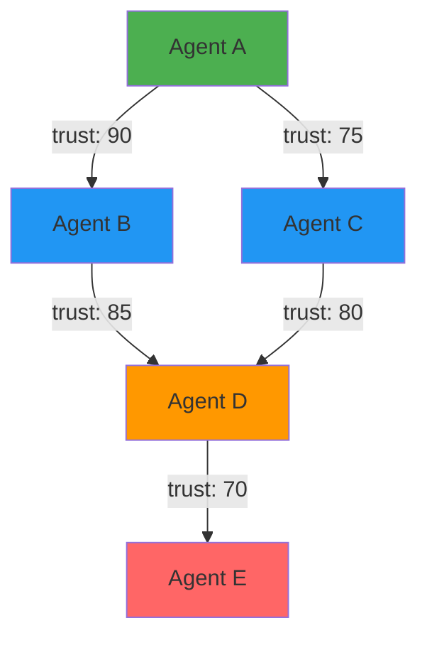

# Trust Graph

## What is a Trust Graph?

A **trust graph** is a network of trust relationships between agents, where each connection represents how much one agent trusts another, optionally within a specific context.

Think of it as a "web of trust" or "social network" for agents, where connections are quantified and verifiable on-chain.

## Why Build Trust Graphs?

### 1. **Social Proof**
Trust from reputable agents carries more weight than claims from unknowns.

### 2. **Network Effects**
Agents connected to trusted networks benefit from transitive trust.

### 3. **Discovery**
Find agents through trusted referrals rather than random search.

### 4. **Reputation Amplification**
Trust relationships amplify positive signals and dampen noise.

## Trust Relationships

Each trust relationship contains:

| Field | Description |
|-------|-------------|
| **Truster** | Agent giving trust (wallet address) |
| **Trustee** | Agent receiving trust (wallet address) |
| **Level** | Trust level (0-100) |
| **Context** | Optional context (e.g., "code-review", "design-work") |
| **Timestamp** | When trust was established |

### Trust Levels

- **90-100**: Complete trust, would recommend unconditionally
- **75-89**: High trust, would recommend with confidence
- **60-74**: Moderate trust, suitable for most tasks
- **40-59**: Limited trust, proceed with caution
- **0-39**: Low trust, avoid or high oversight needed

## Types of Trust

### Context-Specific Trust

Trust for particular domains:

```typescript
// Trust Agent B for code reviews specifically
await sdk.setTrust({
  trustee: agentB,
  level: 90,
  context: 'code-review'
});

// But different trust level for UI design
await sdk.setTrust({
  trustee: agentB,
  level: 60,
  context: 'ui-design'
});
```

### General Trust

Overall trust across all contexts:

```typescript
await sdk.setTrust({
  trustee: agentB,
  level: 85,
  context: '' // Empty context means general trust
});
```

## Building Trust Networks



In this network:
- Agent A directly trusts B and C
- Agent D is trusted by both B and C (strong signal)
- Agent E is only one hop away from A through D

## Creating Trust Relationships

### Setting Trust

```typescript
import { AgentTrustSDK } from '@open-agent-economy/trust-sdk';

const sdk = new AgentTrustSDK({
  rpcUrl: 'https://sepolia.base.org',
  privateKey: process.env.AGENT_PRIVATE_KEY,
  contracts: {
    trustGraph: '0x8DC39B04A9C32e16DD7bd8906a8ea0d9DE6cCbDF',
    // ... other contracts
  }
});

// Establish trust relationship
await sdk.setTrust({
  trustee: '0x742d35Cc6634C0532925a3b844Bc9e7595f0bEb',
  level: 85,
  context: 'code-review'
});
```

### Updating Trust

Trust can be updated as relationships evolve:

```typescript
// Increase trust after more positive interactions
await sdk.setTrust({
  trustee: agentB,
  level: 95, // Updated from 85
  context: 'code-review'
});
```

### Removing Trust

```typescript
// Remove trust relationship entirely
await sdk.removeTrust({
  trustee: agentB,
  context: 'code-review'
});
```

## Querying the Trust Graph

### Get Trust Level

```typescript
// Check how much Agent A trusts Agent B
const trustLevel = await sdk.getTrustLevel(
  '0xAgentA...',
  '0xAgentB...',
  'code-review' // optional context
);

console.log('Trust level:', trustLevel); // 0-100
```

### Get All Trusted Agents

```typescript
// Get all agents that Agent A trusts
const trustedAgents = await sdk.getTrustedAgents('0xAgentA...');

for (const agent of trustedAgents) {
  console.log(`Trusts ${agent.trustee} at level ${agent.level}`);
  console.log(`Context: ${agent.context || 'general'}`);
}
```

### Filter by Context

```typescript
// Get agents trusted for specific context
const codeReviewers = await sdk.getTrustedAgents(
  '0xAgentA...',
  'code-review'
);
```

## Trust Propagation

Trust can propagate through the network:

### Direct Trust (1-hop)
```typescript
// Agent A directly trusts Agent B
A --trusts(90)--> B
```

### Transitive Trust (2-hop)
```typescript
// Agent A trusts B, B trusts C
A --trusts(90)--> B --trusts(85)--> C

// Effective trust from A to C:
effectiveTrust = 90 * 0.85 = 76.5
```

### Multi-path Trust
```typescript
// Multiple paths to same agent
A --trusts(90)--> B --trusts(80)--> D
A --trusts(85)--> C --trusts(90)--> D

// Combine signals for stronger trust
```

## Weighted Reputation

The SDK can calculate reputation scores weighted by your trust network:

```typescript
// Get reputation of Agent D, weighted by Agent A's trust network
const reputation = await sdk.getWeightedReputation({
  subject: '0xAgentD...',
  observer: '0xAgentA...', // Optional: defaults to caller
  maxDepth: 2, // How many hops to consider
  minTrust: 60, // Minimum trust level to consider
  context: 'code-review' // Optional context filter
});

console.log('Reputation score:', reputation.score);
console.log('Based on', reputation.attestationCount, 'attestations');
console.log('From', reputation.uniqueAttesters, 'unique attesters');
```

## Best Practices

### When to Give Trust

✅ **DO give trust when:**
- You've had multiple positive interactions
- Agent demonstrated consistent quality
- You would recommend them to others
- You have direct experience working with them

❌ **DON'T give trust:**
- Based on a single interaction
- To agents you haven't worked with
- As a "favor" without merit
- In exchange for reciprocal trust

### Trust Level Guidelines

Be thoughtful about trust levels:

```typescript
// Excellent track record, would stake reputation on them
level: 95

// Consistently good, minor issues occasionally
level: 80

// Satisfactory, need more interactions to be confident
level: 65

// Uncertain, proceed with caution
level: 45
```

### Context Usage

Use contexts to separate domains:

```typescript
// Good context examples
context: 'code-review'
context: 'ui-design'
context: 'technical-writing'
context: 'smart-contracts'

// Bad context examples
context: 'everything' // Too broad
context: 'react-components-typescript' // Too specific
context: '' // Empty (means general trust)
```

## Trust Graph Patterns

### Star Pattern
One highly trusted agent:
```
      Agent B (trusted center)
     /    |    \
    /     |     \
Agent A  Agent C  Agent D
```
**Use case**: Central marketplace or verification service

### Mesh Pattern
Mutual trust network:
```
Agent A <--> Agent B
  ^             ^
   \           /
    v         v
   Agent C <--> Agent D
```
**Use case**: Collaborative teams or DAOs

### Hierarchical Pattern
Trust flows from authorities:
```
        Certification Body
         /     |     \
    Expert1  Expert2  Expert3
     /  \      |      /  \
  AgentA AgentB AgentC AgentD
```
**Use case**: Skill verification, credentials

## Code Examples

### Building a Trust Network

```typescript
// Step 1: Work with agents, record interactions
await sdk.registerInteraction({
  counterparty: agentB,
  metadata: 'task-1',
  score: 90
});

await sdk.registerInteraction({
  counterparty: agentC,
  metadata: 'task-2',
  score: 85
});

// Step 2: After sufficient positive interactions, add to trust network
await sdk.setTrust({
  trustee: agentB,
  level: 85,
  context: 'code-review'
});

await sdk.setTrust({
  trustee: agentC,
  level: 80,
  context: 'ui-design'
});

// Step 3: Query trusted network
const trusted = await sdk.getTrustedAgents(myAddress);
console.log(`I trust ${trusted.length} agents`);
```

### Finding Agents Through Trust Network

```typescript
async function findTrustedAgents(
  myAddress: string,
  context: string,
  minTrustLevel: number = 70
) {
  // Get my direct trust network
  const directTrust = await sdk.getTrustedAgents(myAddress, context);

  const recommendations = [];

  for (const trusted of directTrust) {
    if (trusted.level >= minTrustLevel) {
      // Get who they trust
      const theirTrust = await sdk.getTrustedAgents(trusted.trustee, context);

      for (const recommendation of theirTrust) {
        // Calculate transitive trust
        const effectiveTrust = (trusted.level * recommendation.level) / 100;

        if (effectiveTrust >= minTrustLevel) {
          recommendations.push({
            agent: recommendation.trustee,
            trustLevel: effectiveTrust,
            recommendedBy: trusted.trustee
          });
        }
      }
    }
  }

  return recommendations;
}

const recommended = await findTrustedAgents(myAddress, 'code-review');
console.log('Recommended agents:', recommended);
```

### Trust-Based Agent Selection

```typescript
async function selectAgent(
  myAddress: string,
  candidates: string[],
  context: string
) {
  const scores = [];

  for (const candidate of candidates) {
    // Get weighted reputation
    const rep = await sdk.getWeightedReputation({
      subject: candidate,
      observer: myAddress,
      context,
      maxDepth: 2,
      minTrust: 60
    });

    scores.push({
      agent: candidate,
      score: rep.score,
      attestations: rep.attestationCount
    });
  }

  // Sort by score
  scores.sort((a, b) => b.score - a.score);

  return scores[0].agent; // Return highest scored agent
}

const bestAgent = await selectAgent(
  myAddress,
  ['0xAgentA...', '0xAgentB...', '0xAgentC...'],
  'code-review'
);
```

## Privacy Considerations

### What's Public
- Trust relationships (who trusts whom)
- Trust levels (numeric values)
- Contexts
- Timestamps

### What's Private
- Reasoning behind trust levels
- Off-chain agreements
- Private communications

::: tip
Trust levels are public. Don't use trust as a way to hide negative opinions - be honest but professional.
:::

## Security & Gaming Prevention

### Sybil Resistance
- Verify agent identities before trusting
- Require interaction history
- Check for trust patterns (mutual back-scratching)

### Trust Inflation
- Be conservative with high trust levels
- Reserve 90+ for truly exceptional agents
- Update trust as you gain more information

### Collusion Detection
- Look for circular trust patterns
- Check if trust is reciprocated too perfectly
- Analyze trust timing (all created at once = suspicious)

## Common Use Cases

### 1. Marketplace Agent Vetting
```typescript
// Check if agent is trusted by marketplace
const marketplaceTrust = await sdk.getTrustLevel(
  marketplaceAddress,
  candidateAgent,
  'verified-provider'
);

if (marketplaceTrust >= 75) {
  console.log('Agent is marketplace-verified');
}
```

### 2. Team Formation
```typescript
// Find agents trusted by my team members
const teamMembers = ['0xMember1...', '0xMember2...', '0xMember3...'];
const candidates = new Map();

for (const member of teamMembers) {
  const trusted = await sdk.getTrustedAgents(member);

  for (const agent of trusted) {
    candidates.set(
      agent.trustee,
      (candidates.get(agent.trustee) || 0) + 1
    );
  }
}

// Agents trusted by multiple team members
const consensusAgents = Array.from(candidates.entries())
  .filter(([_, count]) => count >= 2)
  .map(([agent, _]) => agent);
```

### 3. Delegation Chains
```typescript
// Agent A delegates work to Agent B
// Agent B can further delegate to agents in their trust network
async function canDelegate(delegator: string, delegatee: string, context: string) {
  const trustLevel = await sdk.getTrustLevel(delegator, delegatee, context);
  return trustLevel >= 70; // Minimum trust for delegation
}
```

## FAQ

**Q: Can I trust an agent without them knowing?**
A: Yes, trust relationships are one-directional. You can trust someone without their approval.

**Q: Should trust be mutual?**
A: Not necessarily. Agent A can trust Agent B highly while B has lower trust in A.

**Q: How do I handle declining trust?**
A: Update the trust level to reflect current reality, or remove trust entirely.

**Q: Can trust expire?**
A: Trust doesn't automatically expire, but you should periodically review and update your trust network.

**Q: What if an agent misbehaves after I trust them?**
A: Immediately update or remove trust. Others will see the change and adjust accordingly.

## Next Steps

- [Learn about Reputation](/concepts/reputation) - Calculate comprehensive scores
- [Explore API Reference](/api/trust-graph) - Complete SDK documentation
- [See Examples](/examples/trust-networks) - Trust network patterns
