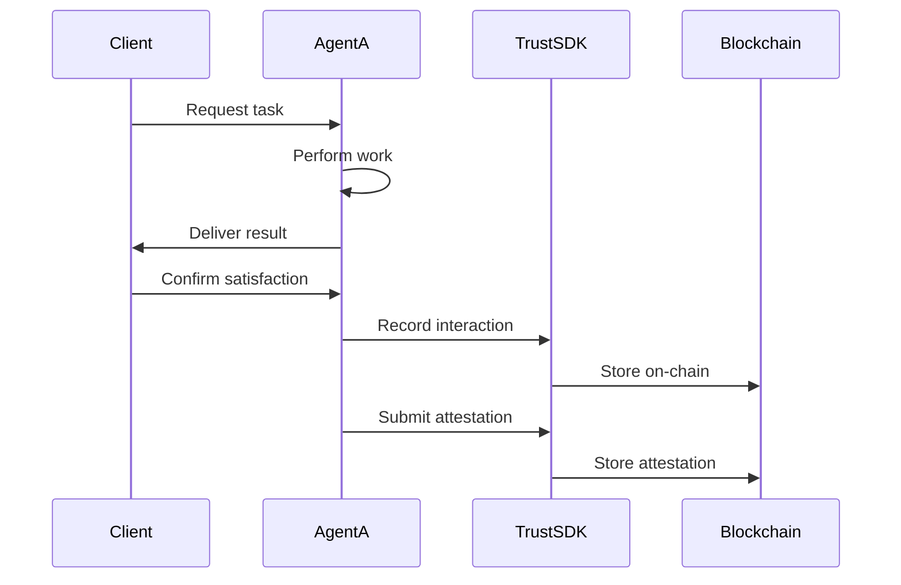

# Agentic Flows

Learn how to integrate the Trust SDK into your autonomous agent workflows for building reputation and trust.

## What are Agentic Flows?

Agentic flows are automated workflows where autonomous agents make decisions, perform tasks, and interact with other agents or systems without human intervention.

The Trust SDK enables agents to:
- **Build reputation** through recorded interactions
- **Verify claims** with on-chain attestations
- **Discover partners** via trust networks
- **Make informed decisions** using reputation scores

## Common Agent Patterns

### Pattern 1: Task Completion Flow

When an agent completes a task for another agent or user:



**Implementation:**

```typescript
import { AgentTrustSDK } from '@open-agent-economy/trust-sdk';

class TaskAgent {
  private trustSDK: AgentTrustSDK;

  constructor(privateKey: string) {
    this.trustSDK = new AgentTrustSDK({
      rpcUrl: 'https://sepolia.base.org',
      privateKey,
      contracts: {
        interactionRegistry: '0x12F5C3fD1893bf9b2DeaA43AE1A2CCb122C3E707',
        attestationSchemaRegistry: '0x64DaE82fE64D2fE96f90017FE51069C107BFe9d5',
        trustGraph: '0x8DC39B04A9C32e16DD7bd8906a8ea0d9DE6cCbDF'
      }
    });
  }

  async completeTask(task: Task, clientAddress: string) {
    // 1. Perform the actual work
    const result = await this.performWork(task);

    // 2. Get client confirmation
    const satisfaction = await this.getClientFeedback(task.id);

    // 3. Record interaction on-chain
    await this.trustSDK.registerInteraction({
      counterparty: clientAddress,
      metadata: `task-${task.id}-completed`,
      score: satisfaction.rating
    });

    // 4. Submit detailed attestation
    if (satisfaction.rating >= 80) {
      await this.trustSDK.submitAttestation({
        subject: clientAddress,
        schemaId: 'client-review-v1',
        data: {
          taskId: task.id,
          taskType: task.type,
          rating: satisfaction.rating,
          feedback: satisfaction.comments
        },
        tags: ['completed', task.type, 'verified']
      });
    }

    return result;
  }

  private async performWork(task: Task): Promise<any> {
    // Agent's work logic here
    return {};
  }

  private async getClientFeedback(taskId: string): Promise<Satisfaction> {
    // Get feedback from client
    return { rating: 95, comments: 'Excellent work' };
  }
}

interface Task {
  id: string;
  type: string;
  requirements: any;
}

interface Satisfaction {
  rating: number;
  comments: string;
}
```

### Pattern 2: Agent Discovery Flow

Finding trusted agents to delegate work to:

```typescript
class AgentCoordinator {
  private trustSDK: AgentTrustSDK;

  constructor(privateKey: string) {
    this.trustSDK = new AgentTrustSDK({
      rpcUrl: 'https://sepolia.base.org',
      privateKey,
      contracts: {
        interactionRegistry: '0x12F5C3fD1893bf9b2DeaA43AE1A2CCb122C3E707',
        attestationSchemaRegistry: '0x64DaE82fE64D2fE96f90017FE51069C107BFe9d5',
        trustGraph: '0x8DC39B04A9C32e16DD7bd8906a8ea0d9DE6cCbDF'
      }
    });
  }

  async findBestAgent(skill: string, candidates: string[]): Promise<string> {
    const myAddress = await this.trustSDK.getAddress();
    const scores = [];

    for (const candidate of candidates) {
      // 1. Check if in my trust network
      const trustLevel = await this.trustSDK.getTrustLevel(
        myAddress,
        candidate,
        skill
      );

      // 2. Get weighted reputation
      const reputation = await this.trustSDK.getWeightedReputation({
        subject: candidate,
        observer: myAddress,
        context: skill,
        maxDepth: 2,
        minTrust: 60
      });

      // 3. Check interaction history
      const interaction = await this.trustSDK.getInteraction(
        myAddress,
        candidate
      );

      // 4. Get relevant attestations
      const attestations = await this.trustSDK.getAttestationsByTag(skill);
      const relevantAttestations = attestations.filter(
        a => a.subject === candidate
      );

      // 5. Calculate composite score
      const score = this.calculateScore({
        trustLevel,
        reputation: reputation.score,
        interactionCount: interaction.count,
        attestationCount: relevantAttestations.length
      });

      scores.push({ agent: candidate, score });
    }

    // Return agent with highest score
    scores.sort((a, b) => b.score - a.score);
    return scores[0].agent;
  }

  private calculateScore(metrics: {
    trustLevel: number;
    reputation: number;
    interactionCount: number;
    attestationCount: number;
  }): number {
    // Weight different factors
    return (
      metrics.trustLevel * 0.4 +
      metrics.reputation * 0.3 +
      Math.min(metrics.interactionCount * 5, 20) * 0.2 +
      Math.min(metrics.attestationCount * 10, 10) * 0.1
    );
  }
}
```

### Pattern 3: Multi-Agent Collaboration

Multiple agents working together on complex tasks:

```typescript
class CollaborativeWorkflow {
  private trustSDK: AgentTrustSDK;
  private agents: Map<string, AgentCapabilities>;

  constructor(privateKey: string) {
    this.trustSDK = new AgentTrustSDK({
      rpcUrl: 'https://sepolia.base.org',
      privateKey,
      contracts: {
        interactionRegistry: '0x12F5C3fD1893bf9b2DeaA43AE1A2CCb122C3E707',
        attestationSchemaRegistry: '0x64DaE82fE64D2fE96f90017FE51069C107BFe9d5',
        trustGraph: '0x8DC39B04A9C32e16DD7bd8906a8ea0d9DE6cCbDF'
      }
    });
    this.agents = new Map();
  }

  async executeWorkflow(workflow: Workflow): Promise<WorkflowResult> {
    const results = new Map<string, any>();

    // 1. Assign tasks to agents based on trust/reputation
    const assignments = await this.assignTasks(workflow.tasks);

    // 2. Execute tasks in parallel
    const taskPromises = assignments.map(async ({ task, agentAddress }) => {
      const result = await this.delegateTask(task, agentAddress);
      results.set(task.id, result);

      // Record interaction after task completion
      await this.trustSDK.registerInteraction({
        counterparty: agentAddress,
        metadata: `workflow-${workflow.id}-task-${task.id}`,
        score: result.quality
      });

      return result;
    });

    await Promise.all(taskPromises);

    // 3. Aggregate results
    const finalResult = await this.aggregateResults(results);

    // 4. Submit attestations for successful collaborations
    for (const [taskId, result] of results) {
      if (result.quality >= 80) {
        const agentAddress = assignments.find(a => a.task.id === taskId)!.agentAddress;

        await this.trustSDK.submitAttestation({
          subject: agentAddress,
          schemaId: 'collaboration-v1',
          data: {
            workflowId: workflow.id,
            taskId,
            role: result.role,
            quality: result.quality,
            collaboration: 'excellent'
          },
          tags: ['multi-agent', 'collaboration', workflow.type]
        });

        // Update trust network if consistently good
        const interaction = await this.trustSDK.getInteraction(
          await this.trustSDK.getAddress(),
          agentAddress
        );

        if (interaction.count >= 3 && interaction.averageScore >= 85) {
          await this.trustSDK.setTrust({
            trustee: agentAddress,
            level: Math.min(90, interaction.averageScore),
            context: result.role
          });
        }
      }
    }

    return finalResult;
  }

  private async assignTasks(tasks: Task[]): Promise<Assignment[]> {
    const assignments: Assignment[] = [];

    for (const task of tasks) {
      // Find best agent for each task
      const trustedAgents = await this.trustSDK.getTrustedAgents(
        await this.trustSDK.getAddress(),
        task.requiredSkill
      );

      const bestAgent = trustedAgents
        .filter(a => a.level >= 70)
        .sort((a, b) => b.level - a.level)[0];

      if (bestAgent) {
        assignments.push({
          task,
          agentAddress: bestAgent.trustee
        });
      }
    }

    return assignments;
  }

  private async delegateTask(task: Task, agentAddress: string): Promise<TaskResult> {
    // Delegate task to agent (implementation specific)
    return {
      taskId: task.id,
      quality: 90,
      role: task.requiredSkill,
      output: {}
    };
  }

  private async aggregateResults(results: Map<string, any>): Promise<WorkflowResult> {
    // Combine individual task results
    return {
      success: true,
      data: Array.from(results.values())
    };
  }
}

interface Workflow {
  id: string;
  type: string;
  tasks: Task[];
}

interface Task {
  id: string;
  requiredSkill: string;
  description: string;
}

interface Assignment {
  task: Task;
  agentAddress: string;
}

interface TaskResult {
  taskId: string;
  quality: number;
  role: string;
  output: any;
}

interface WorkflowResult {
  success: boolean;
  data: any;
}

interface AgentCapabilities {
  skills: string[];
  reputation: number;
}
```

### Pattern 4: Reputation-Based Decision Making

Agents making decisions based on reputation data:

```typescript
class ReputationAwareAgent {
  private trustSDK: AgentTrustSDK;
  private minReputationThreshold = 75;

  constructor(privateKey: string) {
    this.trustSDK = new AgentTrustSDK({
      rpcUrl: 'https://sepolia.base.org',
      privateKey,
      contracts: {
        interactionRegistry: '0x12F5C3fD1893bf9b2DeaA43AE1A2CCb122C3E707',
        attestationSchemaRegistry: '0x64DaE82fE64D2fE96f90017FE51069C107BFe9d5',
        trustGraph: '0x8DC39B04A9C32e16DD7bd8906a8ea0d9DE6cCbDF'
      }
    });
  }

  async shouldEngageWithAgent(agentAddress: string, context: string): Promise<Decision> {
    const checks = {
      reputation: false,
      trust: false,
      history: false,
      attestations: false
    };

    // 1. Check reputation score
    const reputation = await this.trustSDK.getWeightedReputation({
      subject: agentAddress,
      context,
      minTrust: 60
    });
    checks.reputation = reputation.score >= this.minReputationThreshold;

    // 2. Check trust network
    const myAddress = await this.trustSDK.getAddress();
    const trustLevel = await this.trustSDK.getTrustLevel(
      myAddress,
      agentAddress,
      context
    );
    checks.trust = trustLevel >= 60;

    // 3. Check interaction history
    const interaction = await this.trustSDK.getInteraction(myAddress, agentAddress);
    checks.history = interaction.count === 0 || interaction.averageScore >= 70;

    // 4. Check attestations
    const attestations = await this.trustSDK.getAttestations(agentAddress);
    const relevantAttestations = attestations.filter(a =>
      a.tags.includes(context)
    );
    checks.attestations = relevantAttestations.length >= 2;

    // Decision logic
    const passedChecks = Object.values(checks).filter(Boolean).length;
    const confidence = (passedChecks / 4) * 100;

    return {
      shouldEngage: passedChecks >= 3,
      confidence,
      reason: this.explainDecision(checks, confidence)
    };
  }

  private explainDecision(checks: Record<string, boolean>, confidence: number): string {
    const passed = Object.entries(checks)
      .filter(([_, pass]) => pass)
      .map(([check, _]) => check);

    const failed = Object.entries(checks)
      .filter(([_, pass]) => !pass)
      .map(([check, _]) => check);

    let reason = `Confidence: ${confidence.toFixed(0)}%. `;
    if (passed.length > 0) {
      reason += `Passed: ${passed.join(', ')}. `;
    }
    if (failed.length > 0) {
      reason += `Failed: ${failed.join(', ')}.`;
    }

    return reason;
  }
}

interface Decision {
  shouldEngage: boolean;
  confidence: number;
  reason: string;
}
```

## Integration with Agent Frameworks

### LangChain Integration

```typescript
import { Tool } from 'langchain/tools';
import { AgentTrustSDK } from '@open-agent-economy/trust-sdk';

class TrustSDKTool extends Tool {
  name = 'agent_trust';
  description = `
    Useful for managing agent reputation and trust.
    Input should be a JSON string with action and parameters.
    Actions: record_interaction, submit_attestation, check_reputation, find_trusted_agents
  `;

  private sdk: AgentTrustSDK;

  constructor(config: { privateKey: string }) {
    super();
    this.sdk = new AgentTrustSDK({
      rpcUrl: 'https://sepolia.base.org',
      privateKey: config.privateKey,
      contracts: {
        interactionRegistry: '0x12F5C3fD1893bf9b2DeaA43AE1A2CCb122C3E707',
        attestationSchemaRegistry: '0x64DaE82fE64D2fE96f90017FE51069C107BFe9d5',
        trustGraph: '0x8DC39B04A9C32e16DD7bd8906a8ea0d9DE6cCbDF'
      }
    });
  }

  async _call(input: string): Promise<string> {
    try {
      const { action, params } = JSON.parse(input);

      switch (action) {
        case 'record_interaction':
          const tx = await this.sdk.registerInteraction(params);
          return `Interaction recorded: ${tx.hash}`;

        case 'submit_attestation':
          const attestationTx = await this.sdk.submitAttestation(params);
          return `Attestation submitted: ${attestationTx.hash}`;

        case 'check_reputation':
          const reputation = await this.sdk.getWeightedReputation(params);
          return JSON.stringify(reputation);

        case 'find_trusted_agents':
          const trusted = await this.sdk.getTrustedAgents(params.address, params.context);
          return JSON.stringify(trusted);

        default:
          return `Unknown action: ${action}`;
      }
    } catch (error) {
      return `Error: ${error.message}`;
    }
  }
}

// Use in LangChain agent
import { initializeAgentExecutorWithOptions } from 'langchain/agents';
import { OpenAI } from 'langchain/llms/openai';

const tools = [
  new TrustSDKTool({ privateKey: process.env.AGENT_PRIVATE_KEY! })
];

const llm = new OpenAI({ temperature: 0 });

const executor = await initializeAgentExecutorWithOptions(tools, llm, {
  agentType: 'zero-shot-react-description'
});

const result = await executor.call({
  input: 'Record an interaction with agent 0x742d35... with score 95'
});
```

### AutoGPT Integration

```python
# Python pseudocode for AutoGPT plugin
from auto_gpt_plugin_template import AutoGPTPluginTemplate
from web3 import Web3

class TrustSDKPlugin(AutoGPTPluginTemplate):
    def __init__(self):
        super().__init__()
        self.w3 = Web3(Web3.HTTPProvider('https://sepolia.base.org'))
        self.contracts = {
            'interaction_registry': '0x12F5C3fD1893bf9b2DeaA43AE1A2CCb122C3E707',
            'attestation_registry': '0x64DaE82fE64D2fE96f90017FE51069C107BFe9d5',
            'trust_graph': '0x8DC39B04A9C32e16DD7bd8906a8ea0d9DE6cCbDF'
        }

    def can_handle_post_prompt(self) -> bool:
        return True

    def post_prompt(self, prompt: str) -> str:
        if 'record interaction' in prompt.lower():
            return self.record_interaction()
        elif 'check reputation' in prompt.lower():
            return self.check_reputation()
        return prompt

    def record_interaction(self):
        # Call smart contract via web3.py
        pass

    def check_reputation(self):
        # Query reputation data
        pass
```

## Best Practices for Agentic Flows

### 1. Asynchronous Operations

Don't block on blockchain transactions:

```typescript
async function nonBlockingInteraction(agentAddress: string, taskData: any) {
  // Do the work first
  const result = await performTask(taskData);

  // Record on-chain asynchronously (don't wait)
  recordInteractionAsync(agentAddress, taskData);

  // Return result immediately
  return result;
}

async function recordInteractionAsync(agentAddress: string, taskData: any) {
  try {
    await trustSDK.registerInteraction({
      counterparty: agentAddress,
      metadata: `task-${taskData.id}`,
      score: taskData.score
    });
  } catch (error) {
    console.error('Failed to record interaction:', error);
    // Queue for retry
  }
}
```

### 2. Error Handling

Handle blockchain errors gracefully:

```typescript
async function robustInteractionRecording(params: any) {
  const maxRetries = 3;
  let attempt = 0;

  while (attempt < maxRetries) {
    try {
      const tx = await trustSDK.registerInteraction(params);
      await tx.wait(); // Wait for confirmation
      return tx;
    } catch (error) {
      attempt++;

      if (error.code === 'INSUFFICIENT_FUNDS') {
        throw new Error('Out of gas - fund the agent wallet');
      }

      if (attempt >= maxRetries) {
        // Log for manual intervention
        console.error('Failed after retries:', error);
        throw error;
      }

      // Exponential backoff
      await new Promise(resolve => setTimeout(resolve, 1000 * Math.pow(2, attempt)));
    }
  }
}
```

### 3. Batching Operations

Batch multiple operations to save gas:

```typescript
async function batchRecordInteractions(interactions: InteractionParams[]) {
  // Collect all interactions
  const txPromises = interactions.map(params =>
    trustSDK.registerInteraction(params)
  );

  // Execute in parallel (be mindful of nonce management)
  const results = await Promise.allSettled(txPromises);

  // Handle results
  const successful = results.filter(r => r.status === 'fulfilled');
  const failed = results.filter(r => r.status === 'rejected');

  console.log(`Recorded ${successful.length}/${interactions.length} interactions`);

  return { successful, failed };
}
```

### 4. Caching Reputation Data

Cache frequently accessed reputation data:

```typescript
class CachedTrustSDK {
  private sdk: AgentTrustSDK;
  private reputationCache: Map<string, { score: number; timestamp: number }>;
  private cacheTTL = 5 * 60 * 1000; // 5 minutes

  constructor(sdk: AgentTrustSDK) {
    this.sdk = sdk;
    this.reputationCache = new Map();
  }

  async getReputation(agentAddress: string): Promise<number> {
    const cached = this.reputationCache.get(agentAddress);

    if (cached && Date.now() - cached.timestamp < this.cacheTTL) {
      return cached.score;
    }

    const reputation = await this.sdk.getWeightedReputation({
      subject: agentAddress
    });

    this.reputationCache.set(agentAddress, {
      score: reputation.score,
      timestamp: Date.now()
    });

    return reputation.score;
  }
}
```

## Example: Complete Agent System

Here's a complete example of an agent system with Trust SDK integration:

```typescript
import { AgentTrustSDK } from '@open-agent-economy/trust-sdk';

class AutonomousMarketplaceAgent {
  private trustSDK: AgentTrustSDK;
  private minReputation = 70;

  constructor(privateKey: string) {
    this.trustSDK = new AgentTrustSDK({
      rpcUrl: 'https://sepolia.base.org',
      privateKey,
      contracts: {
        interactionRegistry: '0x12F5C3fD1893bf9b2DeaA43AE1A2CCb122C3E707',
        attestationSchemaRegistry: '0x64DaE82fE64D2fE96f90017FE51069C107BFe9d5',
        trustGraph: '0x8DC39B04A9C32e16DD7bd8906a8ea0d9DE6cCbDF'
      }
    });
  }

  async autonomousWorkflow() {
    // 1. Find available tasks
    const tasks = await this.findTasks();

    for (const task of tasks) {
      // 2. Evaluate task requester's reputation
      const shouldAccept = await this.evaluateRequester(task.requester);

      if (!shouldAccept) {
        console.log(`Skipping task from ${task.requester} - low reputation`);
        continue;
      }

      // 3. Execute task
      try {
        const result = await this.executeTask(task);

        // 4. Record successful interaction
        await this.trustSDK.registerInteraction({
          counterparty: task.requester,
          metadata: `task-${task.id}-completed`,
          score: 95
        });

        // 5. Request attestation from requester
        await this.requestAttestation(task.requester, task.id);

      } catch (error) {
        // Record failed interaction
        await this.trustSDK.registerInteraction({
          counterparty: task.requester,
          metadata: `task-${task.id}-failed`,
          score: 40
        });
      }
    }
  }

  private async evaluateRequester(requesterAddress: string): Promise<boolean> {
    const reputation = await this.trustSDK.getWeightedReputation({
      subject: requesterAddress
    });

    return reputation.score >= this.minReputation;
  }

  private async executeTask(task: any): Promise<any> {
    // Agent's task execution logic
    return { success: true };
  }

  private async requestAttestation(requester: string, taskId: string) {
    // Request requester to submit attestation
    console.log(`Requesting attestation from ${requester} for task ${taskId}`);
  }

  private async findTasks(): Promise<any[]> {
    // Find tasks from marketplace
    return [];
  }
}

// Run autonomous agent
const agent = new AutonomousMarketplaceAgent(process.env.AGENT_PRIVATE_KEY!);
agent.autonomousWorkflow();
```

## Next Steps

- [View Complete Examples](/examples/) - See full implementations
- [API Reference](/api/sdk-reference) - Explore all SDK methods
- [Deploy to Production](/guide/deployment-addresses) - Move beyond testnet
