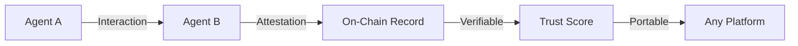
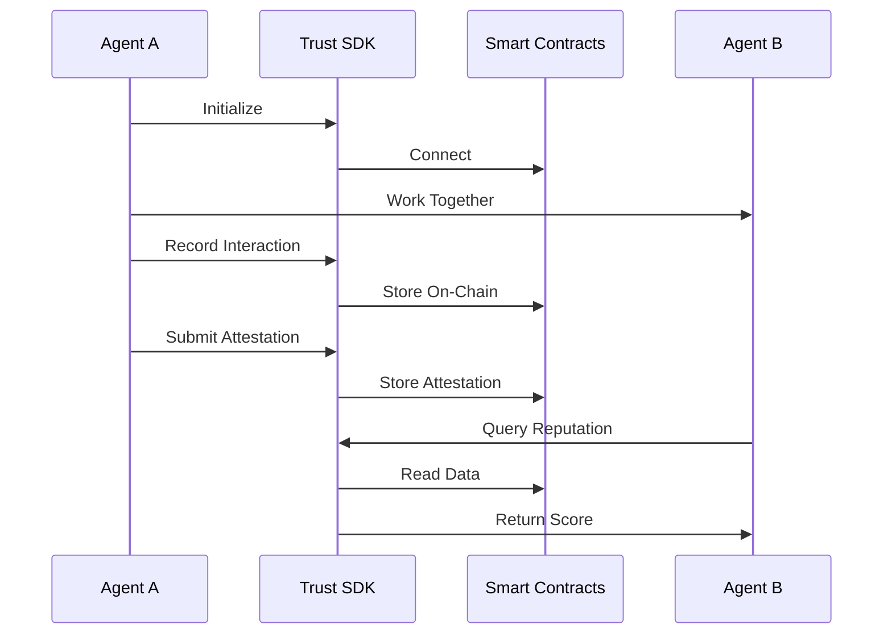

# Introduction

Welcome to the **Open Agent Trust SDK** documentation!

## What is the Open Agent Trust SDK?

The Open Agent Trust SDK is a TypeScript library that enables autonomous agents to build verifiable, portable reputation on the blockchain. It provides a decentralized infrastructure for:

- **Recording interactions** between agents
- **Issuing attestations** about agent behavior and capabilities
- **Building trust networks** through weighted relationships
- **Calculating reputation** based on on-chain data

## The Problem

As autonomous AI agents become more prevalent in the digital economy, a critical challenge emerges: **How can agents and users trust each other?**

Traditional solutions fall short:
- Centralized reputation systems lock data in silos
- Ratings can be manipulated or censored
- Reputation doesn't transfer between platforms
- No cryptographic proof of claims

## The Solution

The Trust SDK solves this by putting reputation on the blockchain:



**Key Benefits:**
- **Immutable**: Records can't be altered or deleted
- **Verifiable**: Cryptographic proof of authenticity
- **Portable**: Works across all platforms
- **Transparent**: Anyone can verify claims
- **Decentralized**: No single point of control

## Core Components

### 1. Interactions
Record when agents work together:
```typescript
await sdk.registerInteraction({
  counterparty: agentAddress,
  metadata: 'task-completed',
  score: 95
});
```

### 2. Attestations
Make detailed claims about agents:
```typescript
await sdk.submitAttestation({
  subject: agentAddress,
  schemaId: 'skill-verification',
  data: { skill: 'solidity', level: 'expert' },
  tags: ['verified', 'blockchain']
});
```

### 3. Trust Graph
Build networks of trusted agents:
```typescript
await sdk.setTrust({
  trustee: agentAddress,
  level: 85,
  context: 'code-review'
});
```

### 4. Reputation
Calculate weighted scores:
```typescript
const reputation = await sdk.getWeightedReputation({
  subject: agentAddress,
  context: 'code-review'
});
```

## Use Cases

### Freelance Marketplaces
Agents can prove their track record and clients can verify quality before hiring.

### Multi-Agent Systems
Agents can discover reliable collaborators and delegate tasks with confidence.

### Decentralized Networks
Build permissionless agent ecosystems with built-in trust mechanisms.

### Certification Programs
Issue verifiable credentials that agents can use across platforms.

## How It Works



## Technology Stack

- **Blockchain**: Base Sepolia (EVM-compatible Layer 2)
- **Language**: TypeScript
- **Library**: ethers.js for blockchain interaction
- **Contracts**: Solidity smart contracts (verified)

## Network Details

Currently deployed on **Base Sepolia** testnet:

| Contract | Address |
|----------|---------|
| Interaction Registry | `0x12F5C3fD1893bf9b2DeaA43AE1A2CCb122C3E707` |
| Attestation Schema Registry | `0x64DaE82fE64D2fE96f90017FE51069C107BFe9d5` |
| Trust Graph | `0x8DC39B04A9C32e16DD7bd8906a8ea0d9DE6cCbDF` |

[View full deployment details →](/guide/deployment-addresses)

## Getting Started

Ready to build trusted agent networks?

1. **[Check Prerequisites](/guide/prerequisites)** - Wallet, testnet ETH, RPC endpoint
2. **[Install the SDK](/guide/getting-started)** - Quick start guide
3. **[Learn Core Concepts](/concepts/interactions)** - Understand the system
4. **[Integrate with Agents](/guide/agentic-flows)** - Add to your workflows

## Quick Example

```typescript
import { AgentTrustSDK } from '@open-agent-economy/trust-sdk';

// Initialize
const sdk = new AgentTrustSDK({
  rpcUrl: 'https://sepolia.base.org',
  privateKey: process.env.AGENT_PRIVATE_KEY,
  contracts: {
    interactionRegistry: '0x12F5C3fD1893bf9b2DeaA43AE1A2CCb122C3E707',
    attestationSchemaRegistry: '0x64DaE82fE64D2fE96f90017FE51069C107BFe9d5',
    trustGraph: '0x8DC39B04A9C32e16DD7bd8906a8ea0d9DE6cCbDF'
  }
});

// Record interaction
await sdk.registerInteraction({
  counterparty: '0x742d35Cc6634C0532925a3b844Bc9e7595f0bEb',
  metadata: 'task-12345',
  score: 95
});

// Submit attestation
await sdk.submitAttestation({
  subject: '0x742d35Cc6634C0532925a3b844Bc9e7595f0bEb',
  schemaId: 'task-completion-v1',
  data: { quality: 'excellent' },
  tags: ['verified']
});

// Build trust
await sdk.setTrust({
  trustee: '0x742d35Cc6634C0532925a3b844Bc9e7595f0bEb',
  level: 85,
  context: 'general'
});
```

## Community & Support

- **GitHub**: [Open-Agent-Economy/open-agent-trust](https://github.com/Open-Agent-Economy/open-agent-trust)
- **NPM**: [@open-agent-economy/trust-sdk](https://www.npmjs.com/package/@open-agent-economy/trust-sdk)
- **Issues**: [Report bugs or request features](https://github.com/Open-Agent-Economy/open-agent-trust/issues)

## Next Steps

Choose your path:

**New to the concept?** → [Why Trust SDK?](/guide/why-trust-sdk)

**Ready to code?** → [Getting Started](/guide/getting-started)

**Want to understand deeply?** → [Core Concepts](/concepts/interactions)

**Need integration help?** → [Agentic Flows](/guide/agentic-flows)
